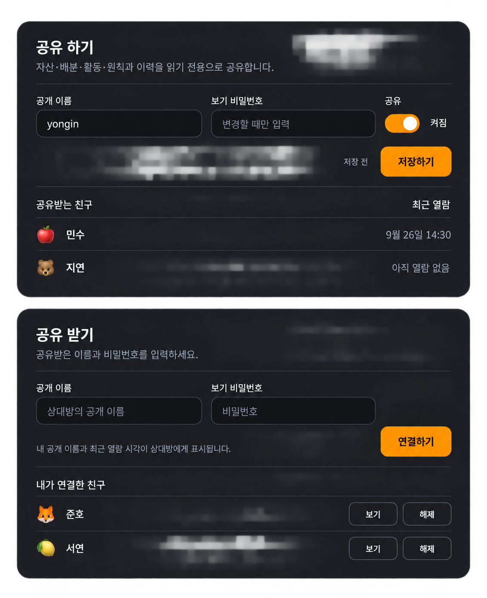

# [공유 UX] 설정 일괄 저장과 공유받는 친구·최근 열람 표시

2026-09-26 · Astra 설계 완료 · Sol 일반 로컬 구현/검증 완료 · 운영 전.

GitHub: https://github.com/kimyongin/fin/issues/146

## 목적과 기존 구현

공유 하기/받기를 같은 폼과 목록 구조로 맞추고, 내 포트폴리오를 연결한 친구와 최근 열람 시각을 확인한다. #145의 전체 포트폴리오 읽기 권한은 유지한다. 이 티켓은 #145의 제목 옆 토글·즉시 저장·접속 정보만 별도 저장 UI를 대체한다. #145의 구현/검증 기록은 당시 결과로 보존한다.

현재 `SettingsPage`는 두 카드와 공유 받기의 연결/보기/해제를 제공한다. `accessActions.saveViewerProfile`은 토글 즉시 저장과 접속 정보 저장을 분기한다. 기존 4인자 `set_viewer_profile`은 이름·비밀번호·공유 여부를 원자적으로 저장할 수 있어 재사용한다. `friendships`는 `(viewer_user_id, owner_user_id)` 관계와 `created_at`을 가지며 `list_friends`는 내가 연결한 상대만 조회한다. 반대 방향 목록과 최근 열람 저장은 현재 없다.

## 승인 시안과 버튼 보정

시안 파일은 저장소의 `docs/design/assets/sharing-settings-preview-20260926.png`에 보관했다. 현재 미푸시 상태이므로 GitHub에서는 이미지가 아직 표시되지 않을 수 있다. 구현자는 로컬 원본을 확인한다.

시안의 카드·필드·목록 구조를 기준으로 하되 **공유 받기의 연결하기 배치에는 아래 보정이 우선**한다. 시안 속 이름과 시각은 예시다.

- 두 카드 공통 순서: 제목/짧은 설명 → 구분선 → 라벨·입력과 같은 행의 실행 버튼(좁은 화면에서는 아래 행) → 필요한 안내 → 구분선 → 친구 목록.
- 공유 하기: 넓은 화면에서 `공개 이름 | 보기 비밀번호 | 공유 토글`을 한 입력 행에 둔다. 토글 라벨은 `공유`, 옆 상태는 `켜짐/꺼짐`이다. 제목 옆 토글과 별도 현재 상태 박스는 없다. 상태는 저장 전 초안일 수 있으며 변경 중에는 실행 버튼 옆에 `저장 전`을 표시한다.
- 공유 받기: 이름/비밀번호 두 필드는 같은 비율로 늘어나고, `연결하기`는 비밀번호 필드 바로 오른쪽에 둔다. 버튼이 차지하는 폭 외에 빈 열을 만들지 않는다.
- **저장하기는 공유 토글 바로 오른쪽, 연결하기는 비밀번호 입력 바로 오른쪽**에 둔다. 두 버튼은 같은 높이 48px·같은 패딩·같은 강조 스타일을 쓴다. `저장 전`은 저장하기 옆에 둔다. 안내 문구와 버튼은 한 행에 섞지 않는다.
- 공유 받기의 안내는 버튼 행 아래 12px, 왼쪽 정렬: `내 공개 이름과 최근 열람 시각이 상대방에게 표시됩니다.` 기존 연결을 다시 여는 프로필 선택 목록에도 동일한 짧은 안내를 제공해 설정을 거치지 않는 사용자도 알 수 있게 한다. 확인 모달이나 별도 동의 상태는 만들지 않는다.
- 모바일은 입력을 한 열로 쌓는다. 공유 토글과 저장 버튼은 입력 아래 같은 행에, 연결 버튼은 비밀번호 입력 바로 아래 전체 폭으로 둔다. 설명은 자연스럽게 줄바꿈한다. 빈 자리 유지를 위한 가짜 필드를 만들지 않는다.
- [모달 폼](../design/modal-guidelines.md)의 라벨 8px/필드 48px/필드 간격 16px/섹션 24px 및 [타이포그래피](../design/typography-guidelines.md)를 재사용한다. 같은 스타일을 위해 설정을 모달로 바꾸지는 않는다.

## 한 번에 저장

- 토글은 이름·비밀번호와 같은 초안이다. 입력/토글/blur만으로 서버 쓰기를 하지 않는다. `저장하기` 하나가 세 값을 함께 전송한다. 버튼은 같은 자리에 항상 있고 변경이 없거나 최초 조회/저장 중이면 비활성화한다.
- 최초 이름·비밀번호 입력과 공유 ON을 한 번에 저장할 수 있다. 미저장 ON/OFF로 실제 읽기 권한이나 공유받는 친구 목록을 바꾸지 않는다. 저장 성공 후에만 확정 상태를 교체하고 비밀번호 입력을 비운다.
- 기존 이름 형식·중복·비밀번호 길이 검증과 빈 비밀번호=기존 값 유지 계약을 유지한다. OFF만 바꿀 때 새 비밀번호를 요구하지 않는다. 미설정 프로필을 OFF로 유지하는 데 접속 정보를 강제로 만들게 하지 않는다. 잘못 입력한 값이 있으면 부분 저장하지 않고 해당 필드에 오류를 표시한다.
- 기존 `set_viewer_profile(..., input_share_scope: 'portfolio_all')`의 원자 저장을 사용한다. 프로필 아이콘 초안은 포함하지 않는다. 새 버전/영수증/저장 큐를 추가하지 않는다.
- 실패 시 모든 초안을 유지한다. 응답 유실 시 기존 재조회 처리를 재사용해 확정 상태를 확인하되 권한 확대를 자동 재전송하지 않는다. 재조회 실패는 정상 OFF로 표시하지 않는다. 저장 중 중복 실행을 막는다.
- 설정 탭 이동 뒤 초안을 임의로 제출하지 않는다. 기존 상위 초안 보존 흐름을 유지하고 저장 전 이탈 시 다음 진입에 초안이 남는지 검증한다. 브라우저 새로고침 시 초안이 사라질 수 있다는 기존 한계를 위해 새 전역 모달/저장소를 만들지 않는다.

## 공유 관계 목록

- 공유 하기 아래 제목 `공유받는 친구`, 행은 `아이콘 + 공개 이름 | 최근 열람`. 자기 포트폴리오를 연결한 로그인 사용자만 표시한다. 상호 연결이나 그 친구의 공유 ON을 요구하지 않는다.
- 공개 이름이 없으면 `이름 없는 친구`, 아이콘은 기존 기본 아이콘을 사용한다. 이메일·로그인 제공자 이름·토큰으로 대체하지 않는다. 연결자의 공개 이름/아이콘/최근 열람 정보만 소유자의 설정에서 제한적으로 읽는다. 일반 공유 콘텐츠에 친구 목록을 포함하지 않는다.
- 공유 OFF에서도 관계 목록과 기존 시각을 유지한다. 상대가 연결을 해제하면 행도 사라진다. 소유자가 친구별 권한을 켜거나 끄는 버튼은 이번 범위에 없다.
- 공유 받기 아래 제목 `내가 연결한 친구`와 기존 `보기/해제`를 유지한다. 연결 성공은 비밀번호를 비우고 상대 자산으로 이동한다. 중복 연결은 한 행만 유지한다. 소유자가 공유를 중지하면 기존 `list_friends`의 숨김 정책을 유지한다.
- 최근 열람은 `9월 26일 14:30`, 다른 연도면 연도를 포함하고 현재 사용자 시간대로 표시한다. null은 `아직 열람 없음`. 연결일을 열람일로 사용하지 않는다. 실시간 접속 중을 뜻하는 점/배지는 없다.
- 익명 게스트는 친구 목록과 시각 집계에서 제외한다. 로그인 사용자가 게스트 경로만 이용하고 `friendships` 연결이 없는 경우도 동일하다.
- 빈 목록은 한 줄, 조회 오류는 오류+재조회로 구분한다. 설정 진입 시 조회하며 폴링하지 않는다. 긴 이름은 줄바꿈하고 모바일 최근 열람은 이름 아래로 내려도 된다. 행마다 중첩 카드를 만들지 않는다.

## 최소 데이터·API 계약

1. 기존 `friendships`에 nullable `last_viewed_at timestamptz` 하나를 추가한다. 초기값과 기존 연결은 null이다. 별도 방문 이력/세션/접속 카운트/활동 레코드/감사 로그는 만들지 않는다. 연결 해제 시 관계 행과 함께 사라진다.
2. 소유자용 조회 RPC(권장 `app_list_portfolio_viewers`)는 owner를 클라이언트 입력으로 받지 않고 `owner_user_id=auth.uid()`만 반환한다. 공개 이름·아이콘·시각과 페이지 처리에 필요한 식별자만 허용한다. 로그인한 비익명 친구만 대상으로 하고 이메일/인증 메타데이터/비밀번호는 반환하지 않는다. 50행 제한과 더 보기, 안정적인 `created_at, viewer_user_id` 순서의 기존 단순 페이지 방식을 사용한다. 최근 열람 갱신 때문에 목록 순서를 바꾸지 않는다.
3. 열람 표시용 RPC(권장 `app_mark_shared_portfolio_view(input_owner_user_id)`)는 viewer를 `auth.uid()`로 결정하고 비익명 세션·실제 친구 관계·소유자의 공유 ON을 서버에서 검증한 뒤 **기존 관계 행만 서버 현재 시각으로 갱신**한다. 임의 viewer/클라이언트 시각을 받거나 관계를 생성하지 않는다. 제3자의 목록 조회 및 다른 사람을 대신한 시각 쓰기를 거부한다. 일반 클라이언트의 테이블 직접 갱신 권한은 열지 않는다.
4. 시각 의미는 **웹에서 해당 친구의 공유 내용을 성공적으로 불러와 표시한 마지막 시점**이다. 친구로 전환/새로고침/네 탭 진입 후 현재 대상의 읽기가 성공하고 화면에 표시될 때 한 번 신호를 보낸다. 연결만 추가, 인증/권한 확인, 백그라운드 prefetch, 실패한 조회, 본인 보기, 늦게 도착한 이전 owner 응답은 갱신하지 않는다. 같은 진입에서 여러 읽기 RPC가 끝나도 신호는 한 번이다.
5. 공통 권한 함수 `can_view_owner/can_view_feature`나 모든 읽기 RPC에 쓰기를 삽입하지 않는다. 기존 웹의 대상/요청 수명 검사를 활용한 작은 호출 경로로 묶고 범용 추적 시스템을 만들지 않는다. 서버 수신 시각 기준의 마지막 웹 열람 신호이며 모든 외부 API 접근의 감사 증명은 아니다. 신호 실패는 콘텐츠 표시를 막지 않고 자동 재시도 큐도 만들지 않는다. 다음 정상 진입 때 갱신한다.
6. 기존 관계/개인 데이터와 #145의 전체 공유·구 클라이언트 ON 제한을 유지한다. 이 변경 자체를 이유로 공유 상태를 다시 OFF로 일괄 전환하지 않는다. 증분 migration과 스키마 인덱스를 갱신한다. 현재 공개 MCP는 본인 데이터 접근이므로 새 열람 표시/친구 목록 도구를 추가하지 않는다. 가이드의 공유 설정 설명만 필요에 맞게 갱신한다.

## 수직 슬라이스와 인수

1. 공유 설정 초안 → 한 번에 저장 → 재조회: 기존 RPC를 재사용해 카드 배치·실패/초안 처리까지 마친다.
2. 친구가 연결·열람 → 기존 관계에 시각 기록 → 소유자 설정 목록 표시: DB/RPC/웹을 한 흐름으로 구현하고 연결 해제·공유 OFF·권한 거부를 검증한다.

- [x] 두 카드에서 필드→독립 액션 행→안내→목록의 간격/정렬이 일치하고, 공유 받기 필드에 불필요한 세 번째 빈 열이 없다.
- [x] 토글 조작만으로 네트워크 쓰기가 없고 최초 설정+ON, 기존 OFF/ON, 빈 비밀번호 유지, 실패 후 초안 보존이 동작한다.
- [x] 연결만 한 친구는 아직 열람 없음, 성공적으로 공유 화면을 본 친구는 서버 시각이 표시된다. 본인/게스트/실패/배경 조회/이전 owner 응답은 기록하지 않는다.
- [x] 상대가 본인 공유를 꺼도 내 공유받는 친구 목록에는 보인다. 내 전체 OFF에서도 목록은 남되 새 열람 갱신은 거부하고 연결 해제 시 행이 사라진다.
- [x] 다른 소유자 목록/다른 viewer 위조/클라이언트 임의 시각/직접 테이블 갱신을 거부하고 공개 프로필 외 개인정보가 노출되지 않는다.
- [ ] 360/390/768/1024/1440px에서 두 카드의 같은 폭 캡처를 비교한다. 긴 이름·빈 목록·여러 행·미저장/저장 중/오류, 키보드·200% 확대·44px 조작 영역을 확인한다.
- [ ] 관련 단위/DB/웹 E2E·빌드·인코딩·workflow guide 검사를 수행하고 로컬/운영 및 미검증 범위를 구분한다.

## 설계 당시 인계

이 티켓과 승인 시안은 설계 산출물이다. 앱 코드·DB·실제 공유값은 변경하지 않았다. Sol은 #145의 현재 미커밋 구현을 보존하며 위 순서로 시작한다. 운영 적용은 별도 릴리스 단계다.

## Sol 구현·검증 기록 (2026-09-26)

- 기존 4인자 `set_viewer_profile`을 초안의 이름·비밀번호·공유 여부 한 번 저장에 재사용했다. 토글 자체는 쓰지 않으며 실패 시 초안을 유지한다. `app_list_portfolio_viewers`와 `app_mark_shared_portfolio_view`는 기존 관계 행의 nullable 열람 시각만 조회·갱신한다. 일반 로컬 DB에는 `20260926054910_sharing_viewer_last_seen.sql`을 적용했고 원격에는 적용하지 않았다.
- 웹에서는 자산 공통 상태와 현재 탭의 성공한 조회가 모두 확인된 후 한 번만 열람 신호를 보낸다. E2E 지연 응답 테스트가 처음에 실제 경계 문제를 발견했고 이를 고쳐 재실행 통과했다. 신호 실패는 화면을 막거나 자동 재시도하지 않는다.
- `npm test`: 109개 통과. `npm run test:db`: 604개 통과. 격리 `.e2e`의 MCP/배포 준비 계약 검사와 공유 설정·친구 연결·지연 응답 Playwright 회귀 4개 통과. `npm run build`, `npm run check:encoding`, `npm run check:workflow-guides` 통과. 기존 Vite 번들 크기 경고와 DB lint의 기존 함수 경고는 남는다.
- 360/390/768/1024/1440px에서 두 카드의 44px 이상 버튼과 가로 넘침 없음을 E2E로 확인했고 390px의 200% 루트 글자 확대도 확인했다. 후속 정돈에서 넓은 화면의 버튼을 입력 바로 오른쪽 같은 높이로, 좁은 화면에서는 입력 아래로 배치했다. 긴 이름/50행 이상 목록, 전체 키보드 동선, 승인 이미지와의 정밀 시각 비교는 아직 수동 확인하지 않았다.
- 운영 마이그레이션·웹 배포, 실제 다른 사용자 계정에서의 열람 시각 확인은 미실시다. 방대한 기존 미커밋 변경을 보존했으며 이번 작업도 커밋·푸시하지 않았다.
